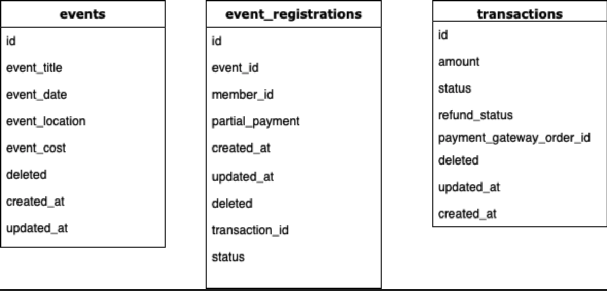

# Database Evaluation Task

Let's design an event registration system! 

This database is not bound to any particular technology (e.g. SQL or NoSQL), and we are looking for clarity in communication, ability to turn abstract concepts into practical steps, and systematic thinking.

## Here are the requirements
- Required fields for each event are: **event title, event date, event location** and **registration cost**. 
- We have registered members (you can access member id, name, email etc.), and only members are allowed to register.
- Event registrations can be cancelled and/or transferred to different events. 
- Members can pay fully or partially at the time of registration.

## Questions
1. As per the above provided requirements, define the minimal database structure which can satisfy the requirements. No queries are required, and what required tables and fields required?
 
2. Define what steps required for event registration (i.e. database flow). Suppose you are already logged in and on registration page with option to select event from dropdown list, member information is available globally.
 
 Ans: 
  you'll get the event_id from the list of events in the events table & member_id from the members table
      2) pass the event_id and member_id to a createEventRegistration query in the backend
      3) registration will get created with a status of pending payment or you can create the event after payment is done. 
      4) to transfer registration just replace the member_id
      5) event_id & member_id will be a compound key in the event_registration table. as in there will be a unique combination of both in each row.
      6) by this architecture, one event can have multiple registrations. one member can have multiple registrations. one registration can only refer to one event. one transaction to only one registration.
 
3. Describe the database flow for cancellation and/or refund?
